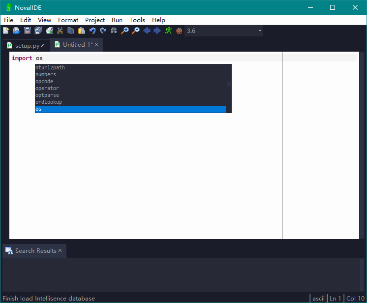
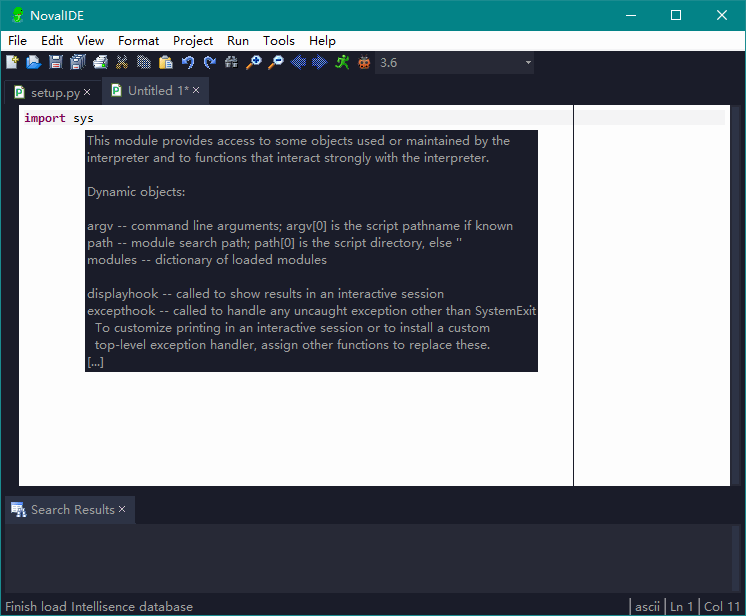
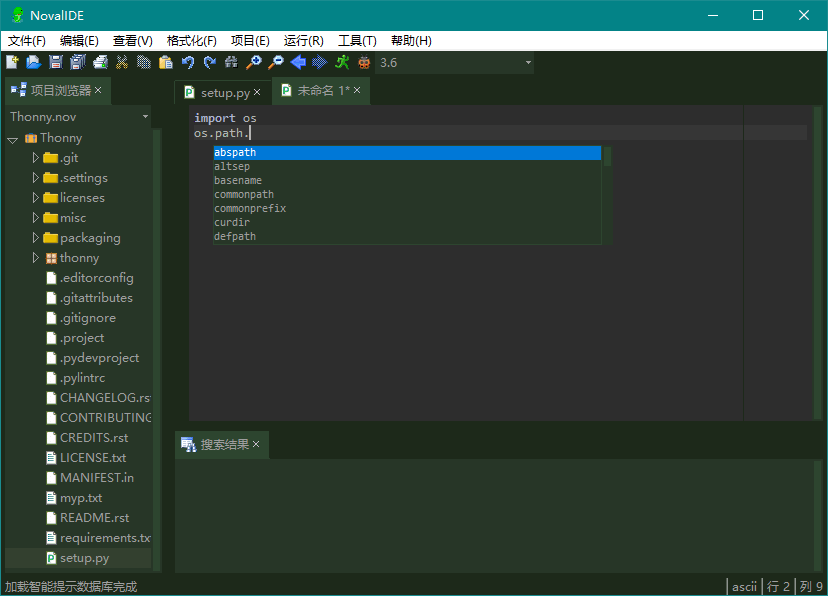
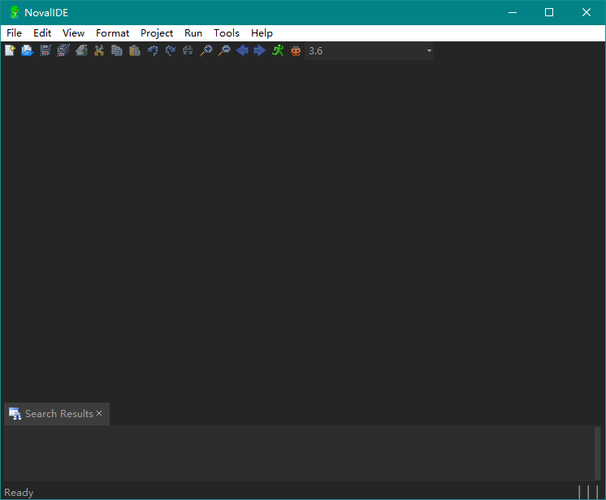
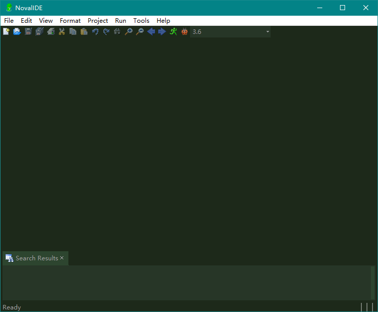
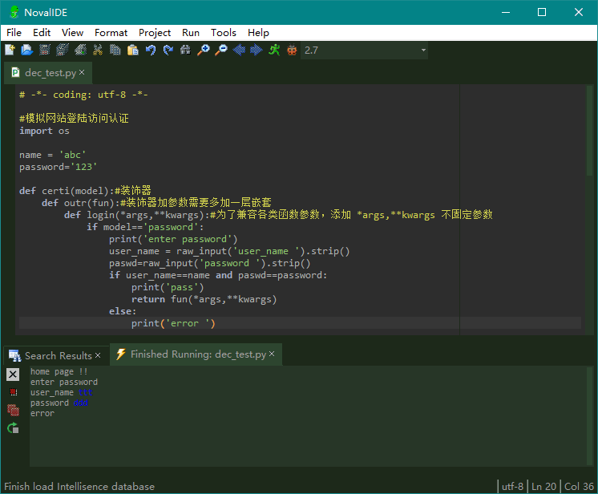
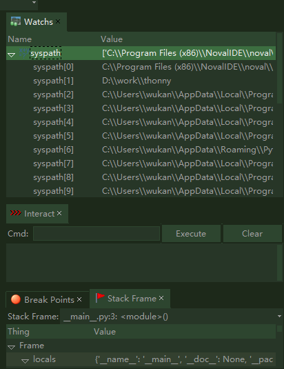
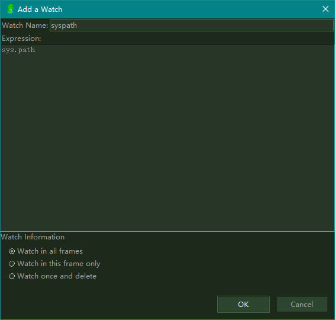

简介
----------------------------------

NovalIDE是一款开源，跨平台，而且免费的国产多功能，轻便的Python IDE，大小才11M

- 强大的代码渲染引擎，出色的语法高亮功能,目前支持python,c/c++渲染,并可选多种代码语法主题
- 自动检测，并加载Python解释器，允许用户自由添加删除解释器，并选择相应的解释器运行脚本
- 出色的函数智能提示和代码自动完成功能
- 支持新建NovalIDE工程和从现有代码创建工程，新建工程类型将包括应用程序，Django,Flask,wxPython,Py2exe,Win32,GTK，控制台程序等
- 自动智能分析解释器系统路径下模块文件，并生成智能提示使用的数据文件
- 支持切换UI皮肤，多达6种UI皮肤可以切换
- 各种复杂的编辑功能，支持高级编辑功能
- 可以调试以及模拟真实环境的终端方式运行python脚本
- 自动模拟Python解释器环境，并内嵌解释器，不用安装任何python环境，即可运行python程序
- 可以断点调试，单步调试python代码，并能监视，查看变量以及堆栈变化，以及添加，删除，管理断点等
- 可以自由终止，重启以及运行调试环境
- 支持运行多个解释器版本，并在不同版本之间进行切换
- 支持中英文多个国际语言版本,并预留其它国际语言的翻译接口
- 灵活的高扩展性，提供开放式接口支持程序员开发自定义插件
- 强大的包管理器，通过pip一键式安装卸载Python包
- 支持python2.6,2.7版本以及python3.x版本,2.6以前版本未实测

官方网址：[http://www.novalide.com](http://www.novalide.com/)

相关文章:

- [对一款优秀国产Python IDE---NovalIDE的体验](https://my.oschina.net/u/3728672/blog/1817030)
- [Linux如何安装NovalIDE](https://my.oschina.net/u/3728672/blog/1831452)
- [再体验国产最好的Python IDE之NovalIDE](https://my.oschina.net/u/3728672/blog/3125055)
- [也评一款轻量好用的ide:NovalIDE](https://blog.csdn.net/weixin_41102672/article/details/104716291)
- [国产开发工具NovalIDE](https://mp.weixin.qq.com/s?__biz=MjM5NDcxMDQzNA==&mid=2247484035&idx=1&sn=c3850d4cfe69981e3fd8c54e9c5eb710&chksm=a682d44e91f55d5888dad0b93dafa9187d0457883e852b49257abe9c163417e45b2ba5ea03c3&mpshare=1&scene=1&srcid=03097fyonpD2itt8KVkulOis&sharer_sharetime=1583723932040&sharer_shareid=520973c84f026e66e7ec93c13eb3129a&key=9be9032765bbfbbefa11fed11940f2508f5e9c67b9cce265d565998acfe8b40e4e73d845d52942a6f54f5dedce2fdad207249e5326a29265e6f18dd580bec9e59d98fe903e61d9c9da792f175a7f716f&ascene=1&uin=Nzc2Njk5MzI0&devicetype=Windows+7&version=6208006f&lang=zh_CN&exportkey=A8Gh3VCBZ2AxrNmxY%2B%2BXyK8%3D&pass_ticket=4f%2BTd0L9WM5wsbcYeGG5XygO5wlXZ%2BV89O52qIlEhFFlZFU%2BihOP3ZPRqHR%2F3rIn)

软件概貌: 

编译
----------------------------------

### 源码依赖包

- Python3.6.4及以上 [Windows下载地址](https://www.python.org/ftp/python/3.6.4/python-3.6.4.exe)
- tkinter(8.5.5以上)
- pywin32(only windows)
- pyinstaller
- wmi(only windows)
- psutil
- watchdog
- chardet
- pyperclip
- requests
- pillow

### Windows编译

- **源码运行**

```
下载python3.6，以及pywin32，pyinstaller安装包，下载地址见上。
git clone https://gitee.com/wekay/NovalIDE.git
cd NovalIDE

pip install psutil
pip install watchdog
pip install chardet
pip install pyperclip
pip install wmi
pip install requests

运行Python NovalIDE.py
```

- **源码打包**

```
运行pyinstaller.exe pyinstaller.novalide.python.spec
生成dist目录下运行NovalIDE.exe
```

### Linux编译

- **Ubuntu**

- sudo apt-get install python3-tk(python3)

- **Centos**

- sudo yum install tkinter

- **编译步骤**

```
git clone https://gitee.com/wekay/NovalIDE.git
cd Noval
运行python3 setup.py install，权限不够请用sudo
最后运行Python3 NovalIDE.py或者直接运行NovalIDE命令
```

安装
----------------------------------

### Windows安装

从官网：[http://www.novalide.com](http://www.novalide.com/)下载[Windows版本](http://www.novalide.com/member/download_app?lang=zh_cn&os_name=win32)

点击NovalIDE_Setup.exe并依次按安装向导安装，直到完成。


### Linux安装
从官网：[http://www.novalide.com](http://www.novalide.com/)下载[Linux版本](http://www.novalide.com/member/download_app?lang=zh_cn&os_name=linux)并解压 

- **Ubuntu**

- sudo apt-get install python3-tk(python3)

- **Centos**

- sudo yum install tkinter

- **安装步骤**

```
运行python3 setup.py install，权限不够请用sudo
最后运行NovalIDE命令。
```

功能截图
----------------------------------

- 智能提示




- 切换UI主题




- 切换语法主题


- 解释器配置


- 包管理器


- 中英文切换


- 单元测试


- 新建工程


- 导入项目文件


- 项目运行配置


- 自动加载解释器


- 运行



- 断点调试





- 监视断点



特别感谢
----------------------------------

- 感谢欢夏女士帮助制作官网特效
- 感谢回想之后同学提供官网域名以及参与制作官网页面


捐赠
----------------------------------

- 支付宝


- 微信支付

